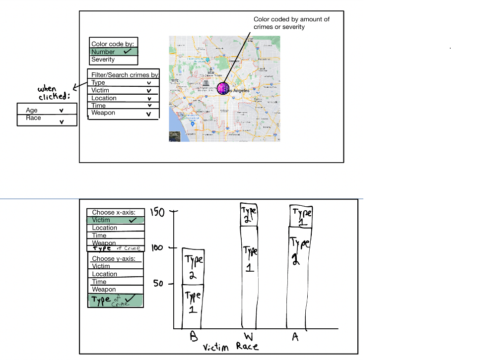
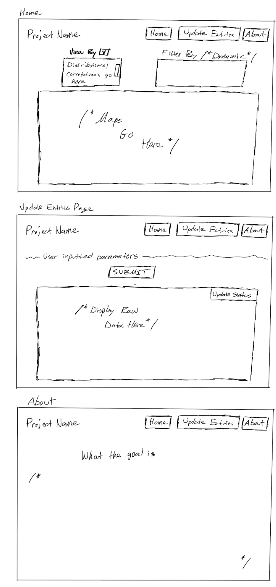

# LA Crime Analysis

## Project Summary/Description
Los Angeles has a significant crime problem with over 123,000 a year, which greatly exceeds that of cities with comparable size. The focus of   this project is to compile large amounts of data to help investigators find hotspots that the crime is originating from, which would allow the LAPD to more efficiently attack the issue. It will be presented via a web application with an interactive map. One of our focuses is on where the most firearms have been used. This information could be used to track down arms dealers and where they engage in transactions, so the LAPD can target more dealers while spending less time searching. We also plan to create a metric that combines the number of violent crimes and the severity of the crimes for a specific area (both will be calculated per capita). Based on the metric, that area will be shaded a certain color on a map that the LAPD could use to better understand where to allocate more or less resources. We also plan to allow the user to filter the crimes on the map by a variety of parameters such as time of day, victim information, and in what type of establishment the crime occurred. With access to this data, it will make it much easier for the LAPD to target crime-ridden neighborhoods, and give them a briefing on what to expect before tackling the crime head on.

## Dataset Info:
**Dataset:** Crime in Los Angeles Data from 2020 to Present  
**Source:** https://www.kaggle.com/datasets/susant4learning/crime-in-los-angeles-data-from-2020-to-present  
**Content:** #DR_NO, Date of Report, Date of Occurrence, Time of Occurrence, Area, Area Name, Report District Number, Crime Committed, Crime Code, Modus Operandi, Victim Age, Victim Sex, Victim Descent, Premise Code, Premise Descent, Weapon Used, Weapon Descent, Status, Status Desc, Crime Code, Location, Cross Street Location, Latitude, Longitude.

## Website Functionality
The website would offer visual outputs of the data correlations, allowing for the user to view maps unfiltered or through specific parameters of their choosing.   
Basic functions: search, add, delete, and update crime entries  
More complex features: create statistic charts based on the type of weapons, victim type(gender, descent, sex), area, and time of occurrence.   
**Creative Components:**  We will try to add a safety recommendation module that gives suggestions on time, area of activity to avoid crimes. We will also try to create heat maps that show the frequency of crime occurrence based on crime frequency and degree of violence. To achieve those functionalities, several levels for crime frequency and level of violence will be set based on the analysis of the data, and then plot onto the map of Los Angeles based on their Latitude and Longitude shown in the data set.  

## Usefulness Description
Our chosen application is useful because it allows users to see important information about crime in LA. By finding patterns in type, location, and time of crime, we can provide valuable information to users on which areas they are more likely to be safe in, and provide information to police forces about where to allocate their resources. By providing data on type, location, and time of crime’s correlation with the identity of the victims, we can specify which type of people are more likely to be victims of certain crimes, which is useful information to stop certain crimes from occuring. There are similar applications for visualizing the density and severity of crime in different areas, such as this one:
https://www.neighborhoodscout.com/ca/los-angeles/crime. Ours is different because it will provide other information that approximates locations of weapons dealers using data on the weapon used in different crimes. It will also provide information on which crimes are unsolved, and how the victim of crime, location, and severity, may correlate with if it is unsolved. 

## Realness Description
Our data is the chart of reported crime in the Los Angeles area since 2020, acquired from the PT1 datasets. Therefore it’s a set of data describing a real distribution of events.Even though the data collected in 2020 may not reflect the real situation in current time, it is still a good reference since 3 years is not too long for a city to have tremendous change.

## Work Distribution 
#### Ben:
- Create the interactive map with all the crimes in LA displayed by pins. When a pin is clicked on, all of the crime’s information will be displayed as a pop-up. 
- Create the severity metric that the map uses to shade itself in a certain color.  
#### Aashu:
- Create statistics page that gives weight to project significance  
- Create filter by parameter function on the map  
- Create two dimensional graphs comparing two metrics of interest  
#### Jerry: 
- SQL tables setup, queries, and updates based on user inputs  
#### Eli:
- Build out API that receives data from the SQL database and reroutes it to the frontend for display.https://fastapi.tiangolo.com/   

## Low-Fidelity UI Mockup

